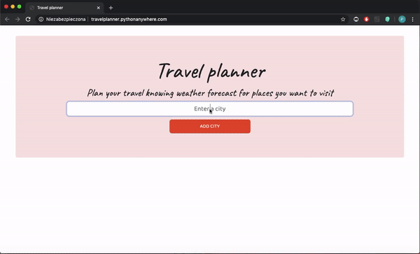
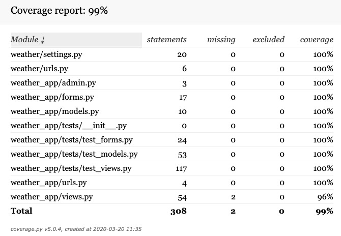

# Reading Tracker App 
#### Django app that helps to manage travels. After entering cities to visit, user finds out weather forecasts and can fill in travel schedules.





## Table of contents:
#### * General info
#### * Technologies 
#### * Setup
#### * Testing
#### * Status

## **General info**:
Django-based app allowing to manage travels in a more efficient way. After adding first city, user is redirected to a new subpage where he can: 
* see weather forecast
* fill in travel schedule
* update schedules
* remove cities and add new ones.

If user wants to create a new list, he have to just go back to the main page and add a new city. Then the new list will be created by itself and generate a new subpage. In case you want to go back to previous list of cities, just remember id of list (e.g. travelplanner.pythonanywhere.com/**lists/5**) and enter this web address.  

## **Technologies**:
* Python 3.7.4
* Django 2.2.6
 
 ## **Setup**:
In case you would like to clone this repository, please know that my operating system is macOS 10.14.6. 

The app is deployed on [travelplanner.pythonanywhere.com](http://travelplanner.pythonanywhere.com/). Check it out.

 ## **Testing**:

The app has been tested by unit tests. **Unit tests** are located in:
```bash
├── weather
    ├── weather_app
        ├── tests
            ├── test_views.py
            ├── test_forms.py
            ├── test_models.py
```
that contains 31 successful unit tests. 
Coverage report generated by third-party package [coverage](https://coverage.readthedocs.io/en/latest/) is located in file coverage_report.html and shows up:



## **Status**:
The project is finished. 
