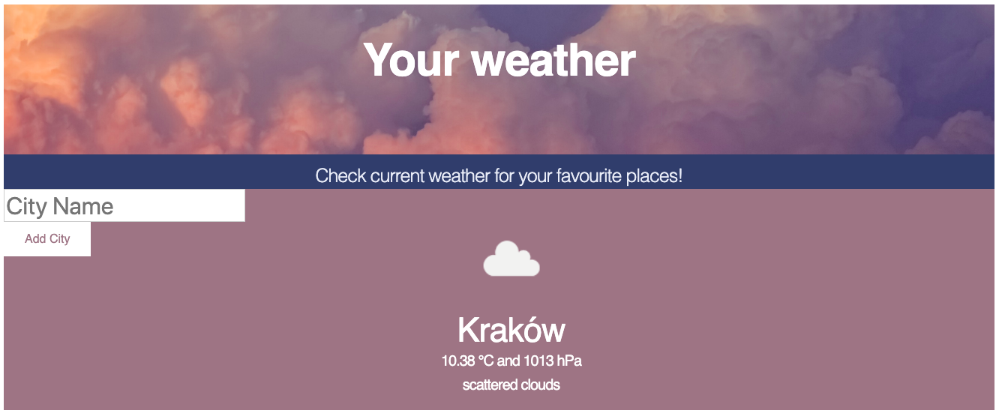

# Weather app
#### Django app based on open weather API enabling to check current weather in whatever place in the world.



## Table of contents:
#### * General info
#### * Technologies 
#### * Setup
#### * Status

## **General info**:
The main goals of this project were **learning Django** framework.
As my target isn't to became a front-end developer, I was satisified with the app having all necessary functions (and as you can see - beautiful interface is not one of them ;).

The main functions are:
* checking current weather (with temperature, pressure and short secription) based on https://openweathermap.org/
* saving search history
* admin panel to manage database 
     
## **Technologies**:
- Python 3.7.4
- Django 2.2.6
- HTML
- Bootstrap 
- CSS

### Libraries and packages which have been used:
 - requests
 - os
 - django modules (shortcuts, urls, test, db, forms, apps, contrib)
 
## **Setup**:
macOS 10.14.6
 
After clonig the repo:
1. Open terminal in place, where file ```manage.py``` is located (folder ```weather```). To make sure enter in command line ```ls``` and check if file ```manage.py``` has been printed.
2. Enter ```python3 manage.py runserver```.
3. Copy ```http://127.0.0.1:8000/``` and paste it in address bar to display the website.

That's all ;)

## **Status**:

The next steps will be adding:
1. unit tests
2. functional tests
3. sign up panel
